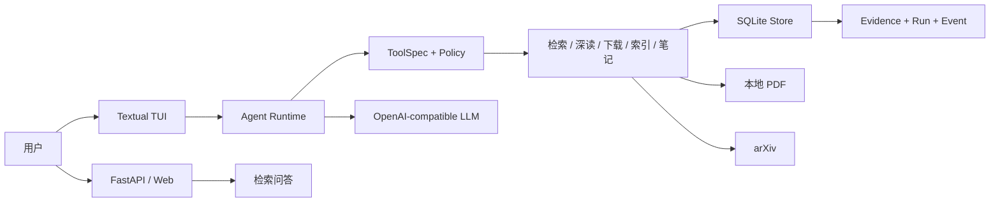
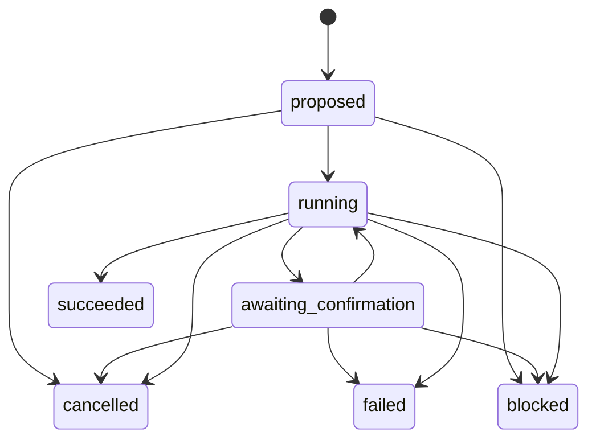

# Paper Research Agent（PRAgent）架构说明

本文描述派生基线 `v0.1.0` 的运行边界与关键设计。PRAgent 是一个证据优先的本地论文研究 Agent：PDF、索引和证据默认保存在本地，模型负责决策与生成，应用代码负责权限、状态、预算和引用约束。

## 组件

- `agent.py`：显式状态机、Planner、Executor、预算和统一引用验证。
- `chat.py`：模型与工具的编排循环、暂停/恢复、结构化事件和最终答案验证。
- `tool_protocol.py` / `tools.py`：工具合同、参数校验、副作用分类、确认票据和执行结果。
- `store.py`：论文、分块、向量、稳定证据、Agent run 和事件日志的 SQLite 兼容门面。
- `storage/migrations.py`：从 v1 开始的有序 schema migrations、迁移历史校验、磁盘库一致备份与事务回滚边界。
- `storage/research_repository.py`：project/source/provenance/artifact revision/evidence link/note 的事务、分页与版本 CAS。
- `storage/job_repository.py`：持久 job、幂等 enqueue、lease claim、progress/cancel/status CAS。
- `search.py`：BM25 与本地向量的混合检索及一致快照缓存。
- `tui.py`：终端 Agent 入口（回答逐字流式渲染）；Web 在 `v0.7.0` 提供检索、SSE 流式问答，以及 SSE 受控 Agent（流式工具调用、可视化确认票据、证据高亮与 run 审计侧栏，`agent_api.py`）。

## Run 生命周期

每次 TUI 问题创建独立 run。轮次、工具调用、外部调用、重规划和引用修复均受硬预算限制；终态不可恢复，非法状态迁移会被拒绝。

## 工具与审批边界

每个工具必须通过 `ToolSpec` 显式声明：

- JSON Schema 参数合同；
- `READ_LOCAL`、`WRITE_LOCAL`、`NETWORK` 副作用；
- 超时和幂等元数据；
- 结构化 `ToolResult`，包括错误码、重试属性和 evidence ID。

写入或联网操作不会立即执行。运行时保存包含工具名、冻结参数、`tool_call_id` 和参数摘要的确认票据；用户批准后只允许执行该票据绑定的动作。取消会补齐原工具协议消息并把 run 转为 `cancelled`。状态 CAS 失败时不清理票据，允许安全重试。

## 证据一致性

检索和深读工具返回稳定的 `[E:ev_…]` 标识。证据保存来源论文哈希、分块文本哈希、页码和快照正文：

- 最终回答只能引用本轮工具实际返回且未过期的 evidence ID；
- PDF 或分块变化后，旧证据保留用于审计，但被标记为 stale，不能进入引用白名单；
- 页面深读前验证磁盘 PDF 哈希与索引一致，避免新正文错误绑定旧证据；
- `paper ask` 的 `[n]` 与 Agent 的 `[E:…]` 使用同一验证模块。

这里验证的是引用身份、范围和新鲜度，不等同于自动证明每个自然语言论断与证据之间存在语义蕴含。

## 持久化与可观测性

SQLite schema v5 保留 v1/v2 的论文索引、证据与 Agent 审计表，并为研究工作区建立持久化边界：

- v1：`papers/chunks/meta`；
- v2：`evidence/agent_runs/agent_events`；
- v3：通用 document locator、project、research question、canonical source/identity、provider record 与 project-source membership；
- v4：artifact、不可变 revision、artifact-evidence link 与 research note；
- v5：可恢复 job、Agent session/transcript 与冻结的 pending action。

每个 migration 都有名称、版本和 SHA-256 checksum 记录。磁盘数据库只在声明版本和已有表结构通过检查后迁移；升级前使用 SQLite backup API 生成一致备份，所有待执行步骤位于同一个 `BEGIN IMMEDIATE` 事务中。任一步、外键检查或历史校验失败都会回滚，未来版本数据库则不做修改并拒绝打开。研究对象与 job 使用独立行 `version` 做 compare-and-swap，不复用只服务于搜索缓存失效的 `index_revision`。完整关系与 freshness 规则见 [数据模型](data-model.md)。

事件默认保存必要元数据、哈希和结果摘要，避免把完整论文正文作为 trace 复制。LLM 响应同时保留 usage、finish reason 和 response ID，供后续成本与延迟评测使用。

### 旧 Pagent 显式导入

`import_pagent.py` 只接受已验证的 Pagent schema v1/v2，默认 dry-run，且从不在旧目录上运行 migration。执行导入时先建立文件 hash 清单，再通过 SQLite online backup 把包含已提交 WAL 的一致快照写入目标同盘 staging；路径重写、v5 migration、计数/外键/quick-check 和文件二次 hash 均在 staging 完成。只有全部通过后才原子重命名为目标目录，目标已存在或中途失败均 fail closed。

## 测试边界

- 单元与集成测试覆盖工具合同、索引与证据一致性、确认/取消、CAS 冲突和 TUI 续跑。
- 37 个离线 JSON 场景用于回归状态机、预算和引用合同。
- 场景使用脚本化模型与工具结果，不代表真实模型质量、提示注入抵抗能力或语义蕴含评测。

下一阶段会在此基础上增加真实任务 benchmark、成本面板、多来源检索与笔记双链。
