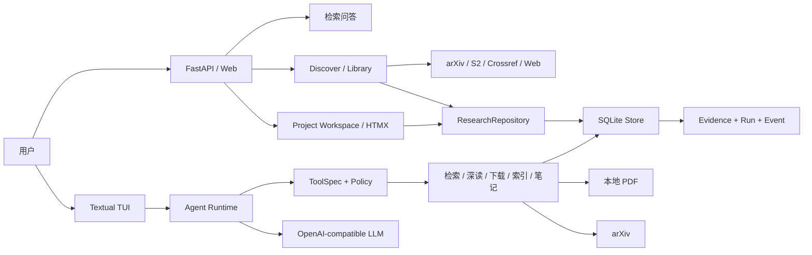
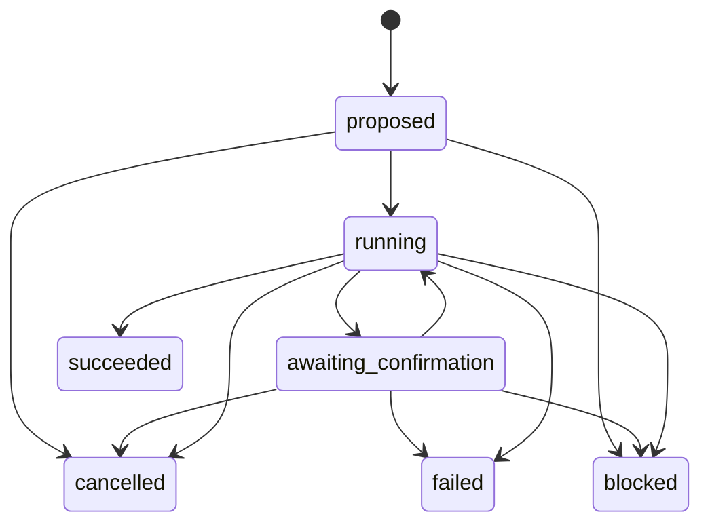

# Paper Research Agent（PRAgent）架构说明

本文描述派生基线 `v0.1.0` 的运行边界与关键设计。PRAgent 是一个证据优先的本地论文研究 Agent：PDF、索引和证据默认保存在本地，模型负责决策与生成，应用代码负责权限、状态、预算和引用约束。

## 组件

- `agent.py`：显式状态机、Planner、Executor、预算和统一引用验证。
- `chat.py`：模型与工具的编排循环、暂停/恢复、结构化事件和最终答案验证。
- `tool_protocol.py` / `tools.py`：工具合同、参数校验、副作用分类、确认票据和执行结果。
- `store.py`：论文、分块、向量、稳定证据、Agent run 和事件日志的 SQLite 兼容门面。
- `storage/migrations.py`：从 v1 开始的有序 schema migrations、迁移历史校验、磁盘库一致备份与事务回滚边界。
- `storage/research_repository.py`：project/source/provenance/artifact revision/evidence link/note 的事务、分页与版本 CAS。
- `storage/job_repository.py`：持久 job、幂等 enqueue、lease claim/renew/reap、progress/cancel/status CAS。
- `jobs/queue.py` / `jobs/worker.py`：启动恢复、仅幂等重排、固定并发 worker、协作取消与 deadline 阶段边界。
- `research/schemas.py` / `research/deep_read.py`：九栏严格 Pydantic schema、字段特定检索、map/reduce、全流程至多一次 JSON repair，以及 retrieval/context/LLM/token 预算。
- `web/routes/projects.py`：`/api/v1` project JSON API 与 Jinja/HTMX project/question/source vertical slice。
- `sources/base.py` / `sources/identity.py`：provider-neutral normalized source contract，以及 DOI → arXiv ID → canonical URL → content SHA 的确定性、可传递合并。
- `sources/arxiv.py`：有界 arXiv Atom adapter；`websearch.py` 仅保留旧调用合同的兼容门面。
- `sources/semantic_scholar.py` / `sources/crossref.py`：字段白名单 adapter、可选认证与 provider 原始记录规范化。
- `sources/http.py` / `sources/discovery.py`：不缓存请求密钥的 fixture/response cache、线程安全节流、429/5xx 有界退避，以及多 provider 聚合与部分失败隔离。
- `sources/actions.py` / `web/routes/discovery.py`：显式网页/PDF 获取动作、公开错误映射，以及 Discover/Library JSON + HTMX vertical slice。
- `research/artifacts.py` / `web/routes/artifacts.py`：Deep Read 全量/单栏生成、人工 revision、严格 evidence 保存，以及九栏 JSON API、HTMX polling、证据抽屉与历史版本。
- `ingestion/safe_fetch.py`：逐跳 URL/DNS 校验并把连接固定到已验证公网 IP；限制重定向、总超时、MIME 与响应大小。
- `ingestion/snapshots.py` / `html_extract.py` / `web.py`：原始 HTML 的 content-addressed gzip 原子快照、Trafilatura 文本抽取及可恢复 source 状态。
- `ingestion/indexing.py`：把网页纯文本或已下载 PDF 适配为通用 `Paper(source_kind/canonical_uri/locator)`，再复用同一 chunk/embed/index/source-link 事务边界。
- `search.py`：PDF 与 Web document 共用 BM25、本地向量、RRF、一致 snapshot cache 和稳定 evidence。
- `tui.py`：终端 Agent 入口（回答逐字流式渲染）；Web 保留兼容工作台，并提供持久项目、Discover 与统一来源库。

## Run 生命周期

每次 TUI 问题创建独立 run。轮次、工具调用、外部调用、重规划和引用修复均受硬预算限制；终态不可恢复，非法状态迁移会被拒绝。

## 工具与审批边界

每个工具必须通过 `ToolSpec` 显式声明：

- JSON Schema 参数合同；
- `READ_LOCAL`、`WRITE_LOCAL`、`NETWORK` 副作用；
- 超时与幂等合同：执行器按 `timeout_seconds` 以单调时钟安装真实 deadline（与外层任务级预算取更紧者），网络 handler 把剩余预算作为 socket 超时传入，长循环逐项检查取消；deadline/取消中断映射为 `tool_deadline_exceeded`/`tool_cancelled` 结果，且仅幂等工具标记可重试，非幂等工具副作用未知不自动重试；
- 结构化 `ToolResult`，包括错误码、重试属性和 evidence ID。

写入或联网操作不会立即执行。运行时保存包含工具名、冻结参数、`tool_call_id` 和参数摘要的确认票据；用户批准后只允许执行该票据绑定的动作。取消会补齐原工具协议消息并把 run 转为 `cancelled`。状态 CAS 失败时不清理票据，允许安全重试。

## 证据一致性

检索和深读工具返回稳定的 `[E:ev_…]` 标识。证据保存来源论文哈希、分块文本哈希、页码和快照正文：

- 最终回答只能引用本轮工具实际返回且未过期的 evidence ID；
- PDF 或分块变化后，旧证据保留用于审计，但被标记为 stale，不能进入引用白名单；
- 页面深读前验证磁盘 PDF 哈希与索引一致，避免新正文错误绑定旧证据；
- `paper ask` 的 `[n]` 与 Agent 的 `[E:…]` 使用同一验证模块。

这里验证的是引用身份、范围和新鲜度，不等同于自动证明每个自然语言论断与证据之间存在语义蕴含。

## 持久化与可观测性

SQLite schema v6 保留 v1/v2 的论文索引、证据与 Agent 审计表，并为研究工作区建立持久化边界：

- v1：`papers/chunks/meta`；
- v2：`evidence/agent_runs/agent_events`；
- v3：通用 document locator、project、research question、canonical source/identity、provider record 与 project-source membership；
- v4：artifact、不可变 revision、artifact-evidence link 与 research note；
- v5：可恢复 job、Agent session/transcript 与冻结的 pending action；
- v6：每个 project/source 唯一的逻辑 `deep_read` artifact。

每个 migration 都有名称、版本和 SHA-256 checksum 记录。磁盘数据库只在声明版本和已有表结构通过检查后迁移；升级前使用 SQLite backup API 生成一致备份，所有待执行步骤位于同一个 `BEGIN IMMEDIATE` 事务中。任一步、外键检查或历史校验失败都会回滚，未来版本数据库则不做修改并拒绝打开。研究对象与 job 使用独立行 `version` 做 compare-and-swap，不复用只服务于搜索缓存失效的 `index_revision`。完整关系与 freshness 规则见 [数据模型](data-model.md)。

Web Agent 首次请求即创建并永久绑定 session 的 `project_id`；run 同时记录 project/session 外键。每个回合把完整消息和可选 `pending_actions` 票据放在同一事务中保存，票据包含冻结参数、参数 SHA-256、action digest、原始 tool call 与 run。重启恢复时同时复核参数哈希和 action digest；确认前再用 SQLite CAS 将票据从 `pending` 原子认领为 `approved`，避免两个服务实例重复执行。project 来源、artifact 与 evidence 只读工具不需要确认，但没有 project 上下文时 fail closed；所有网络或本地写入工具仍由 `ToolEffect` 自动进入确认集合。

SSE 回合与排他锁绑定：每回合持有会话锁，SSE 流提前断开只置位本回合独立的取消事件——回合在阶段边界终止，普通回合的消息恢复到上一个持久化边界，run 转为 `cancelled`；确认续跑中断开时，已执行工具的协议闭合 transcript 保留不回滚。排他锁等 worker 线程真正结束后才释放，断开不会让并发回合同时修改同一 session；断开后的迟到 SSE 事件在 emit 入口丢弃，终态以 Store 中的 run/session 记录为准。

事件默认保存必要元数据、哈希和结果摘要，避免把完整论文正文作为 trace 复制。LLM 响应同时保留 usage、finish reason 和 response ID，供后续成本与延迟评测使用。

### Web 项目工作区边界

`/ui/projects` 使用服务端 Jinja autoescape 与 wheel 内置 HTMX 2.0.8（MIT license 随资源打包），不依赖 Node/CDN。写表单必须同时通过同源检查、1MB body limit 和 HttpOnly/SameSite double-submit CSRF cookie；远程模式先通过 `X-PRA-Key` 换取不含原始 key 的 HttpOnly UI cookie。项目来源响应只返回题录、状态和安全 filename，不返回 `papers.path`、snapshot path 或抽取正文。project、question 与 source membership 均来自 SQLite repository，页面刷新或服务重启不依赖进程内状态。

完整网页威胁模型、DNS pinning、snapshot 与 raw HTML 边界见 [来源抓取安全](source-security.md)。

### CSL 引用边界

`research/citations.py` 把 canonical `ResearchSource` 规范化为 CSL-JSON，并通过 `citeproc-py` 渲染。应用只接受 style registry 中的五个稳定键；CSL XML 从 wheel 的 `pragent/styles` 资源加载且启用 schema validation。未知样式、重复 source ID 或 processor 异常均显式失败，不能静默生成近似格式。

内置 GB/T 7714-2015、APA 7、IEEE、Chicago author-date 与 MLA 样式固定到 Citation Style Language 官方仓库提交 `2a4430b7cadae7cc88012537c5ceaed76d1d9938`，每个文件内含 CC BY-SA 3.0 rights，聚合归因也作为 package data 随 wheel 分发。golden tests 固定单条样例的 citation cluster 和 bibliography 输出；它们验证 processor/style 集成稳定性，不声称覆盖各格式全部边缘规则。

### Deterministic export 边界

`exporting/` 先读取 artifact current pointer，再冻结 immutable revision、canonical sources/provenance、evidence snapshots 和 freshness；结束前重复核对 artifact/source version 与 fingerprint，任何并发漂移都 fail closed。renderer 只消费冻结对象，因此同一 snapshot 的 Markdown/JSON/CSV/DOCX 不受后续 current pointer 变化影响。

Markdown 与 DOCX 使用同一个文档级 CSL processor context；JSON 通过 `ExportEnvelope` schema 后按 key 排序；CSV 固定 header、row order 与 LF；DOCX 固定 core properties、OOXML ZIP entry 顺序/时间和表格 DXA geometry。文件先在目标目录写临时文件，随后 `os.replace`，安全 stem 不接受 Windows 保留名、路径分隔符或控制字符。

Web 正式导出是 idempotent SQLite job：请求把 artifact/source/review-section revision contract 写入 payload，worker 复核后生成到 `exports/<job-id>/`。API/UI 下载不返回或接受服务器绝对路径，而是将 requested basename 与 succeeded job result 文件白名单匹配，再验证 resolve 后仍位于该 job 目录。同步 preview 只返回有长度上限且经模板 autoescape 的 Markdown 文本。

### 旧 Pagent 显式导入

`import_pagent.py` 只接受已验证的 Pagent schema v1/v2，默认 dry-run，且从不在旧目录上运行 migration。执行导入时先建立文件 hash 清单，再通过 SQLite online backup 把包含已提交 WAL 的一致快照写入目标同盘 staging；路径重写、v6 migration、计数/外键/quick-check 和文件二次 hash 均在 staging 完成。只有全部通过后才原子重命名为目标目录，目标已存在或中途失败均 fail closed。

## 测试边界

- 单元与集成测试覆盖工具合同、索引与证据一致性、确认/取消、CAS 冲突和 TUI 续跑。
- 37 个离线 JSON 场景用于回归状态机、预算和引用合同。
- 场景使用脚本化模型与工具结果，不代表真实模型质量、提示注入抵抗能力或语义蕴含评测。

Phase 3 的 provider 与网页测试全部使用 fixture/fake transport，不代表实时服务可用性。Phase 4 的后台任务由 SQLite job 表驱动：Web 启动时先把遗留运行任务标为 interrupted，仅在仍有 attempt 额度时重排声明为 idempotent 的任务，再启动固定数量 worker；取消和 deadline 只在 handler 显式阶段边界生效，不伪装能够强杀正在运行的 SDK 请求。
