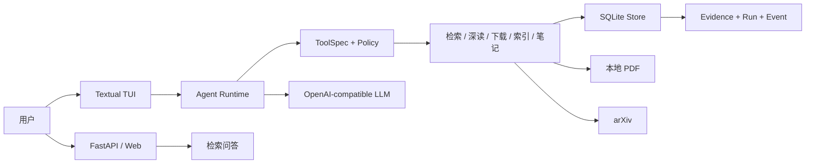
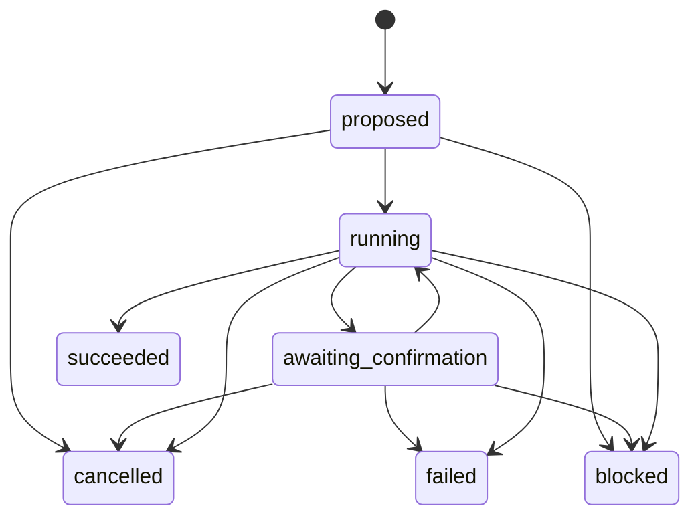

# Pagent（paper-agent）架构说明

本文描述 `v0.7.0` 的运行边界与关键设计。Pagent 是一个证据优先的本地论文研究 Agent：PDF、索引和证据默认保存在本地，模型负责决策与生成，应用代码负责权限、状态、预算和引用约束。

## 组件

- `agent.py`：显式状态机、Planner、Executor、预算和统一引用验证。
- `chat.py`：模型与工具的编排循环、暂停/恢复、结构化事件和最终答案验证。
- `tool_protocol.py` / `tools.py`：工具合同、参数校验、副作用分类、确认票据和执行结果。
- `store.py`：论文、分块、向量、稳定证据、Agent run 和事件日志的 SQLite 持久化。
- `search.py`：BM25 与本地向量的混合检索及一致快照缓存。
- `tui.py`：终端 Agent 入口（回答逐字流式渲染）；Web 在 `v0.7.0` 提供检索、SSE 流式问答，以及 SSE 受控 Agent（流式工具调用、可视化确认票据、证据高亮与 run 审计侧栏，`agent_api.py`）。

## Run 生命周期

每次 TUI 问题创建独立 run。轮次、工具调用、外部调用、重规划和引用修复均受硬预算限制；终态不可恢复，非法状态迁移会被拒绝。

## 工具与审批边界

每个工具必须通过 `ToolSpec` 显式声明：

- JSON Schema 参数合同；
- `READ_LOCAL`、`WRITE_LOCAL`、`NETWORK` 副作用；
- 超时和幂等元数据；
- 结构化 `ToolResult`，包括错误码、重试属性和 evidence ID。

写入或联网操作不会立即执行。运行时保存包含工具名、冻结参数、`tool_call_id` 和参数摘要的确认票据；用户批准后只允许执行该票据绑定的动作。取消会补齐原工具协议消息并把 run 转为 `cancelled`。状态 CAS 失败时不清理票据，允许安全重试。

## 证据一致性

检索和深读工具返回稳定的 `[E:ev_…]` 标识。证据保存来源论文哈希、分块文本哈希、页码和快照正文：

- 最终回答只能引用本轮工具实际返回且未过期的 evidence ID；
- PDF 或分块变化后，旧证据保留用于审计，但被标记为 stale，不能进入引用白名单；
- 页面深读前验证磁盘 PDF 哈希与索引一致，避免新正文错误绑定旧证据；
- `paper ask` 的 `[n]` 与 Agent 的 `[E:…]` 使用同一验证模块。

这里验证的是引用身份、范围和新鲜度，不等同于自动证明每个自然语言论断与证据之间存在语义蕴含。

## 持久化与可观测性

SQLite schema v2 保存论文库和以下 Agent 数据：

- `agent_runs`：目标、计划、预算、状态和错误；
- `agent_events`：有序状态、模型、工具、验证和预算事件；
- `evidence`：稳定证据快照及来源指纹。

事件默认保存必要元数据、哈希和结果摘要，避免把完整论文正文作为 trace 复制。LLM 响应同时保留 usage、finish reason 和 response ID，供后续成本与延迟评测使用。

## 测试边界

- 单元与集成测试覆盖工具合同、索引与证据一致性、确认/取消、CAS 冲突和 TUI 续跑。
- 37 个离线 JSON 场景用于回归状态机、预算和引用合同。
- 场景使用脚本化模型与工具结果，不代表真实模型质量、提示注入抵抗能力或语义蕴含评测。

下一阶段会在此基础上增加真实任务 benchmark、成本面板、多来源检索与笔记双链。
