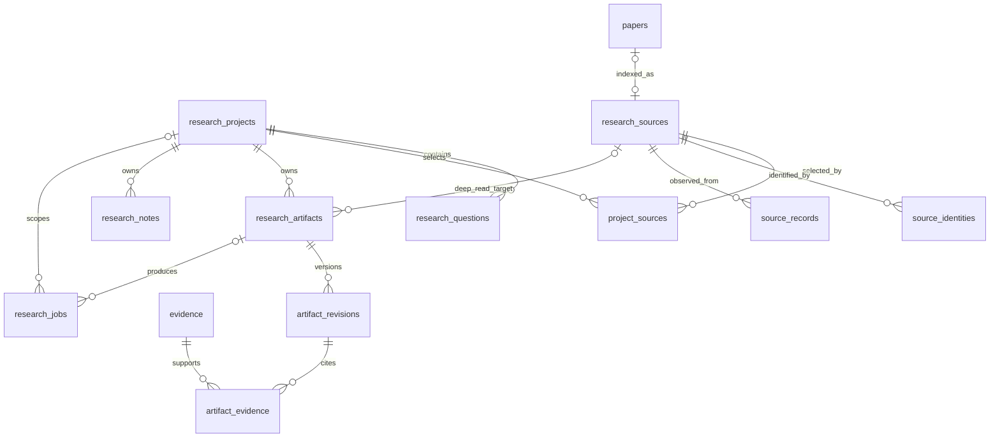

# PRAgent 数据模型

PRAgent 以 SQLite 为 source of truth。`papers/chunks/evidence` 继续承担全文索引与稳定证据；研究工作区通过独立 repository 关联这些兼容表，而不复制检索正文。

## Repository 边界

- `Store`：兼容的论文、分块、检索快照、evidence、Agent run/event。
- `ResearchRepository`：project、question、canonical source/provenance、project membership、artifact revision/evidence link、note。
- `JobRepository`：持久 research job、claim lease、progress、cancel 和状态 CAS。

每个 repository 使用独立 SQLite 连接。复合写入使用显式事务；跨进程竞争通过 `BEGIN IMMEDIATE` 与行 `version` compare-and-swap 协调。研究表的修改不会提高 `index_revision`，只有影响全文检索快照的 `papers/chunks/embed_model` 修改才会使搜索缓存失效。

## 核心关系



## Canonical source 与 provenance

`research_sources` 是 UI/API 使用的统一来源实体。一个来源可以具有多个 `source_identities` 和多个 provider `source_records`：

- identity 类型：normalized DOI、versionless arXiv ID、canonical URL、content SHA-256；
- `(identity_kind, normalized_value)` 全局唯一；
- provider 原始 metadata 作为 JSON 保存，不因 canonical 字段选择而丢失；
- `indexed_paper_id` 可空且唯一，把来源关联到现有全文索引；
- Web snapshot 的路径只在内部表中保存，公开响应不得暴露主机路径。

`ensure_source_for_paper()` 使用论文内容 SHA-256 幂等地把现有本地论文提升为 research source，供项目工作区选择。发现层统一返回 `NormalizedSource`，只使用 DOI → versionless arXiv ID → canonical URL → content SHA-256 作为确定性 identity；标题或作者相似度绝不自动合并。任意共享 identity 都会做传递式分组，canonical metadata 由固定 provider 优先级选择，而每条 provider provenance 均保留。

## Artifact 与 revision

`research_artifacts` 是稳定逻辑对象；`artifact_revisions` 是不可变版本：

- artifact 的 `current_revision_number` 指向当前版本号，避免 artifact/revision 循环外键；
- 新 revision 与 artifact 当前版本在一个事务内提交；
- 人工修改、新模型结果或 repair 均追加 revision，不覆盖历史；
- `artifact_evidence` 关联到具体 revision 与字段路径，而不是只关联 artifact；
- evidence 使用 `ON DELETE RESTRICT`，保证历史 artifact 的证据链不会被静默删除。

每个 revision 保存 `source_fingerprint`。单篇 artifact 的 fingerprint 来自关联 source 的当前 PDF/content/snapshot hash；项目级 artifact 来自排序后的全部 project source。当前 fingerprint 与保存值不一致时 artifact 为 stale，旧 revision 仍可读取。

## Notes

`research_notes.scope_kind` 明确限定三种范围：

- `project`：不带 source/evidence；
- `source`：只带 source；
- `evidence`：只带 evidence。

Repository 同时验证 source 已加入当前 project；数据库 `CHECK` 和外键作为第二层防线。

## Jobs

`research_jobs` 状态：

```text
queued → running → succeeded | failed | cancel_requested | cancelled | interrupted
interrupted → queued | cancelled | failed
```

Job 保存 payload/result、进度、attempt/max-attempt、priority/run-after、timeout、lease、取消时间和错误。`idempotency_key` 使用部分唯一索引；同一个 key 只有在任务语义参数一致时才返回已有记录，否则 fail closed。Claim 与状态更新同时检查 status 和 `version`，避免两个 worker 重复占有同一任务。

Phase 4 的 worker/queue 会复用这些持久化合同，不在 HTTP 请求内执行长任务。
